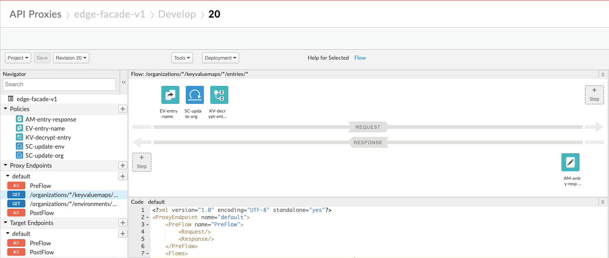

# Apigee Edge Facade API
This Apigee Edge API proxy (edge-facade-v1) is a facade on the Apigee Edge Management API to enable retrieval of encrypted Key Value Map (KVM) entries.
It can be used to facilitate migration from Edge to X when the source of the encrypted KVM entries is not available.
It uses the same [KVM API paths](https://apidocs.apigee.com/docs/key-value-maps/1/overview) as the Edge API for 
[Organziation KVM Entries Get](https://apidocs.apigee.com/docs/key-value-maps/1/routes/organizations/%7Borg_name%7D/apis/%7Bapi_name%7D/keyvaluemaps/%7Bmap_name%7D/entries/%7Bentry_name%7D/get)
 and [Environment KVM Entries Get](https://apidocs.apigee.com/docs/key-value-maps/1/routes/organizations/%7Borg_name%7D/environments/%7Benv_name%7D/keyvaluemaps/%7Bmap_name%7D/entries/%7Bentry_name%7D/get).
 Since the API is a front end to the Edge API, the proxy only needs to be deployed to one environment.

 > **NOTE:** This example exploits an undocumented Edge Management API feature that can modify an existing policy in a deployed proxy. 
>
> It uses a Service Callout to modify the currently deployed revision of itself to re-write the `mapIdentifier` attribute in the KVM policy prior to executing the policy.
 It gets the name for the `mapIdentifier` as well as the KVM entry key name from the API path segments.

 A bash script [kvms-export.sh](kvms-export.sh) is provided that exports all of the organization environment KVMs in a format that is suitable for import into an Apigee X organization using [apigeecli](https://github.com/apigee/apigeecli).


## Use Case
As an Apigee Edge platform owner migrating to Apigee X,\
I need to retrieve private KVM entries,\
So I can import them into X.

## References
[Working with key value maps | Apigee Edge](https://docs.apigee.com/api-platform/cache/key-value-maps)\
[Working with key value maps | Apigee Edge - retrieving values](https://docs.apigee.com/api-platform/cache/key-value-maps#managingandusingkvms-retrievingkvms)\
[Key value maps API - Apigee Edge APIs](https://apidocs.apigee.com/content/keyvalue-maps-management-api)\
[get /organizations/{org_name}/keyvaluemaps/{map_name}/entries/{entry_name}](https://apidocs.apigee.com/docs/key-value-maps/1/routes/organizations/%7Borg_name%7D/keyvaluemaps/%7Bmap_name%7D/entries/%7Bentry_name%7D/get)\
[get /organizations/{org_name}/environments/{env_name}/keyvaluemaps/{map_name}\entries/{entry_name}](https://apidocs.apigee.com/docs/key-value-maps/1/routes/organizations/%7Borg_name%7D/environments/%7Benv_name%7D/keyvaluemaps/%7Bmap_name%7D/entries/%7Bentry_name%7D/get)\
[KVM Operations Policy](https://docs.apigee.com/api-platform/reference/policies/key-value-map-operations-policy)

## Issue
Apigee Edge management APIs do not support retrieval of encrypted KVM entries.\
The only way to retrieve encrypted KVM entries is by using a KVM policy.\
The KVM policy `mapIdentifier` attribute requires a static value and cannot be parameterized.

## Limitations
This “technique” only works for organization and environment scoped KVMs.
API proxy scoped KVMs can only be accessed by the proxy in which they are deployed.

# Solution Architecture


## Overview
Create an Edge KVM entries helper proxy that mimics the Management API for KVM entries (edge-facade-v1)\
Configure the proxy to respond to:
* GET /organizations/*/keyvaluemaps/*/entries/*
* GET /organizations/*/environments/*/keyvaluemaps/*/entries/*

Exploit an undocumented ability to modify an existing policy in a deployed proxy
* Use Service Callouts in the proxy flow to rewrite the KVM policy to change the mapIdentifier attribute and Scope element on the fly
  * Control the Service Callout using a condition for subsequent retrieval of entries in the same KVM
* Use KVM policy to get the entry value in the “private.value” variable
* Use Assign Message policy to return the unencrypted value

## Deployment
Deploy the `edge-facade-v1` proxy to the Edge organization.
```
zip -r edge-facade-v1.zip apiproxy
```
Import into Edge using UI and deploy.

## Test Flow
Call Edge API to retrieve org level KVMs
```
export ORG=your_edge_org
export HOST=your_edge_org-your_env.apigee.net
B64UNPW=$(echo -n 'username@gmail.com:secret123' | base64)
AUTH="Authorization:Basic $B64UNPW"

curl -s -H "$AUTH" https://$HOST/edge-facade/v1/organizations/$ORG/keyvaluemaps | jq
[
  "org-config",
  "org-config-private"
]
```

Call Edge API to retrieve KVM entries
```
curl -s -H "$AUTH" https://$HOST/edge-facade/v1/organizations/$ORG/keyvaluemaps/org-config-private/keys | jq
[
  "private_key1",
  "private_key2"
]
```


Call Edge Facade API proxy to retrieve KVM entries
```
# First call instructs proxy to modify the proxy KVM policy using Service Callout by passing callout query param set to true
curl -s -H "$AUTH" https://$HOST/edge-facade/v1/organizations/$ORG/keyvaluemaps/org-config-private/entries/private_key1?callout=true | jq
{
  "name": "private_key1",
  "value": "private_value1"
}

# Subsequent calls use the currently configured KVM policy
curl -s -H "$AUTH" https://$HOST/edge-facade/v1/organizations/$ORG/keyvaluemaps/org-config-private/entries/private_key2 | jq
{
  "name": "private_key2",
  "value": "private_value2"
}
```

